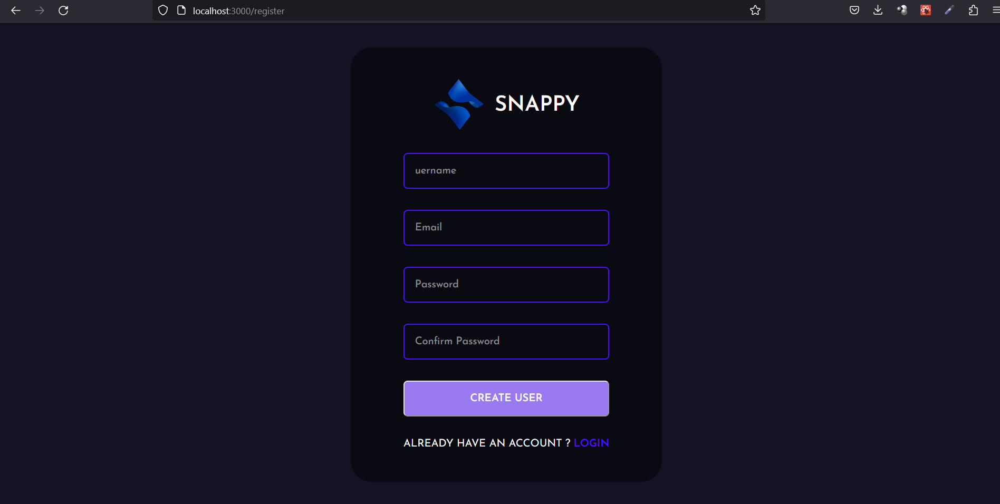
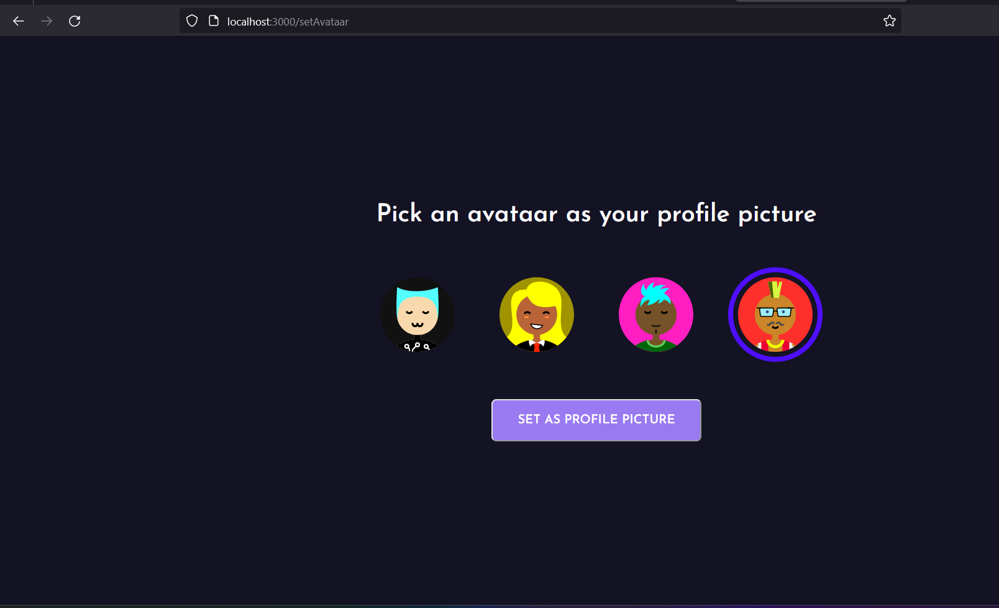

# Snappy-chat | Socket.io | React | Node
Snappy is a real time chat application based on socket.io for communication between multiple clients.

# Technology
- Frontend: JavaScript, React, HTML
- CSS: react's styled component
- Backend: NodeJS, ExpressJS, Axios
- Database: NoSQL (MongoDb)

# App Features
- Login: user can loign into system using username and password.
- 

- user can register if not exists in the System.
- 

- user can set there own avataar after loign into system.
- 

- user can click in the other online users in the System to start messaging at real time.
- user can share the emojis as well.
