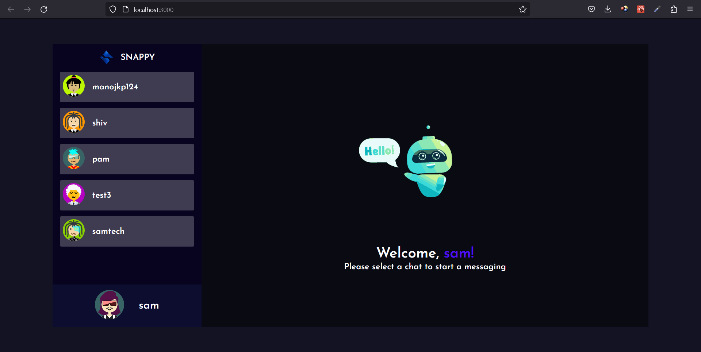
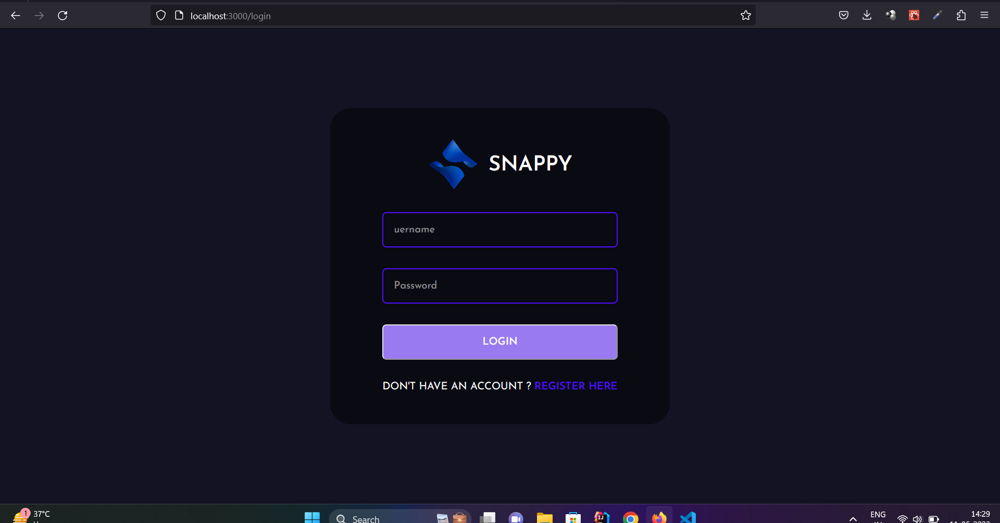
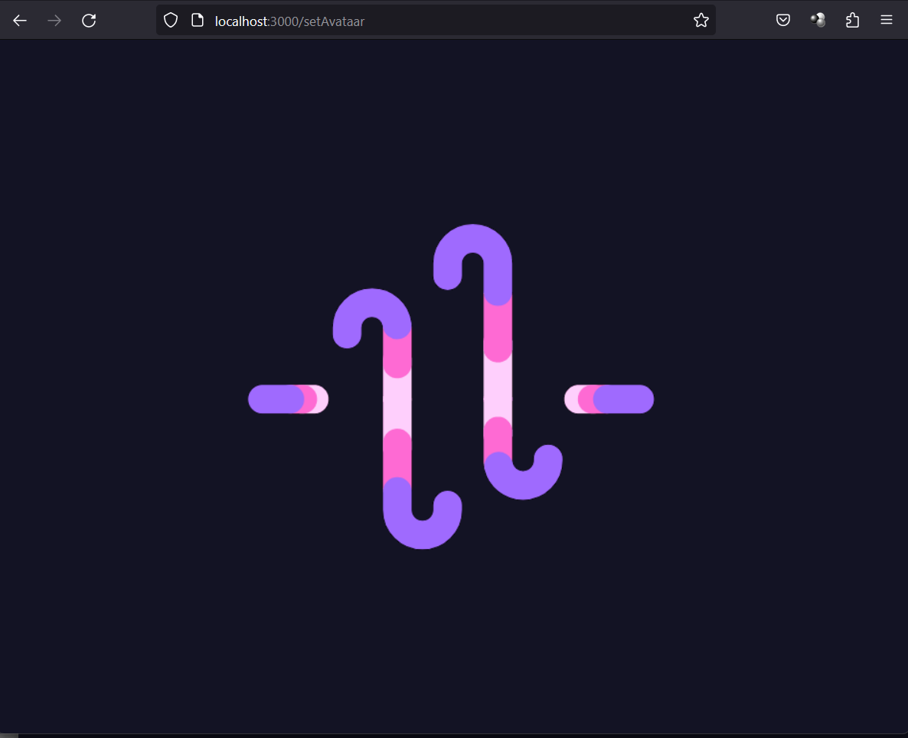
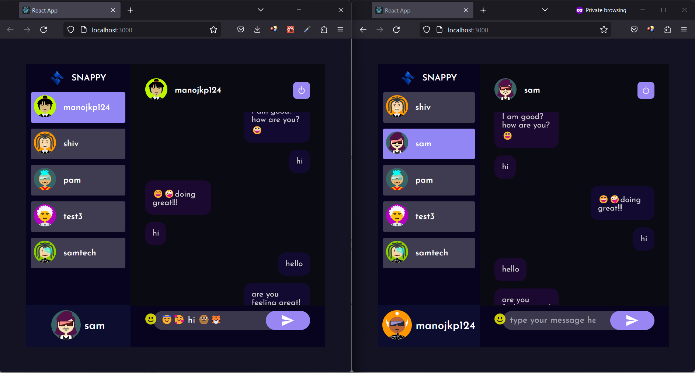
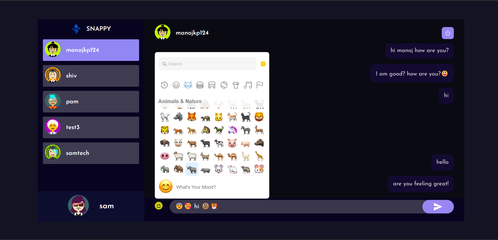

# Snappy-chat

Snappy-chat is a real-time chat application based on socket.io for communication between multiple clients.

## Technology

- **Frontend**: JavaScript, React, HTML
- **CSS**: React's styled-components
- **Backend**: Node.js, Express.js, Axios
- **Database**: NoSQL (MongoDB)

## App Features

### Chat Page

### Login

Users can log in to the system using their username and password.

### Registration

Users can register if they don't have an account.

### Initial Loader

### Set Avatar

Users can set their own avatar after logging in.

### Real-time Chat

Users can click on other online users in the system to start messaging in real-time.

### Emoji Support

Users can share emojis in their messages.

## Features to Be Added

- This app can be customized to attach files and share them with other users.
- Live video chat feature can also be added in the future.

